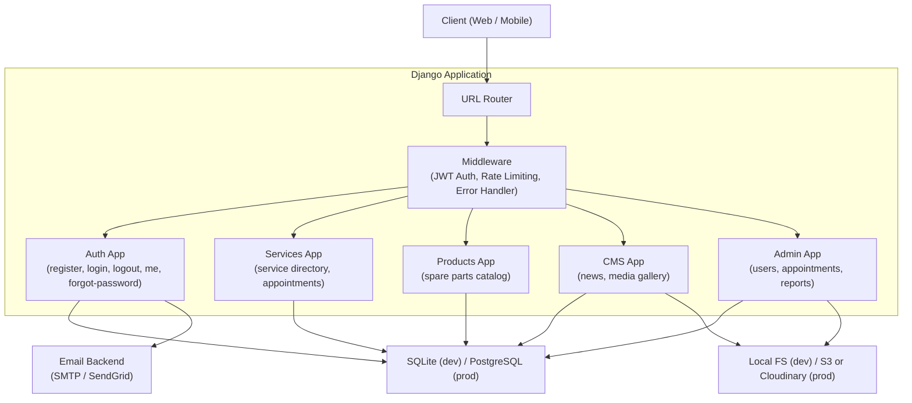
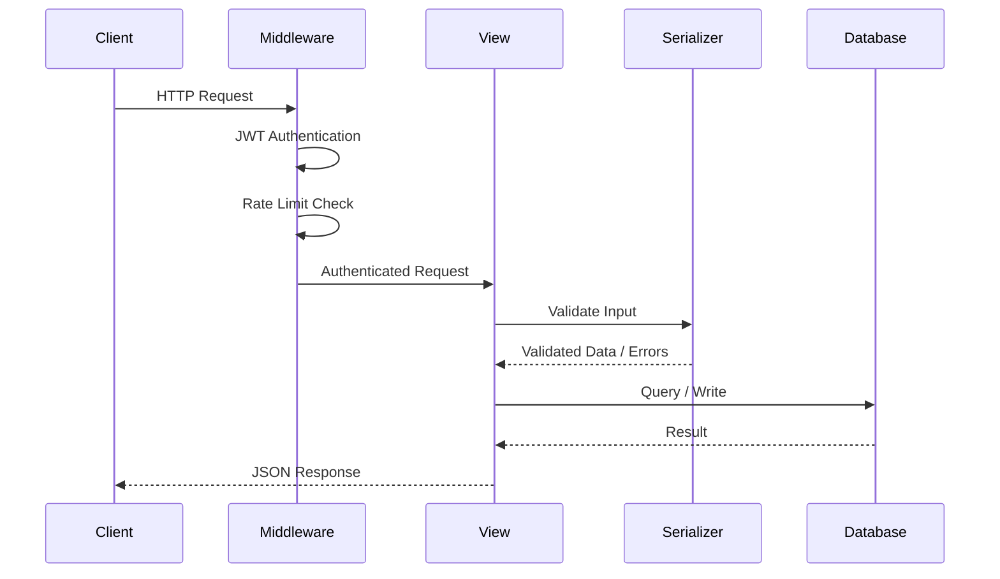
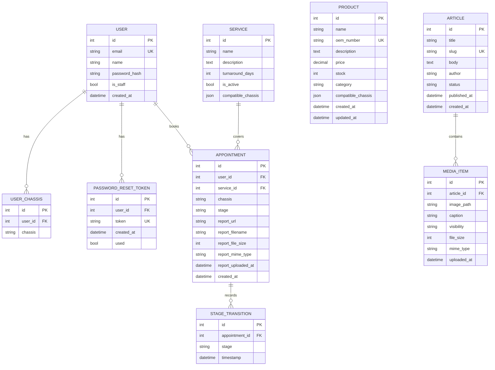

# Design Document: Automobile Backend API

## Overview

The Automobile Backend API is a Django REST Framework (DRF) application that powers an automotive electronic repair and parts management platform. It serves a Mercedes-Benz–focused workshop that offers ECU programming, EIS repair, FBS-4 synchronization, and related electronic services.

The system is organized into five functional domains:

1. **Auth & Security** — JWT-based registration, login, logout, profile retrieval, and password recovery
2. **Technical Services & Appointments** — Service directory, appointment booking, and live repair timeline tracking
3. **Spare Parts / E-Commerce** — Chassis-filtered product catalog with admin inventory management
4. **CMS / Media** — Technical news articles and a public image gallery
5. **Admin & Diagnostic Tools** — User management, appointment status advancement, and diagnostic report attachment

All endpoints follow a consistent JSON response envelope, uniform pagination metadata, and a global error format. SQLite is used for development; the storage backend is local filesystem in development and S3/Cloudinary in production.

---

## Architecture

### High-Level Architecture



### Django App Structure

```
automobile_backend/
├── config/                  # Project settings, URLs, WSGI/ASGI
│   ├── settings/
│   │   ├── base.py
│   │   ├── development.py
│   │   └── production.py
│   ├── urls.py
│   └── wsgi.py
├── apps/
│   ├── authentication/      # User model, JWT auth, password recovery
│   ├── services/            # Service model, Appointment model, timeline
│   ├── products/            # Product model, category, chassis filter
│   ├── cms/                 # Article model, MediaItem model
│   └── admin_tools/         # Admin-only views (users, status, reports)
├── core/
│   ├── pagination.py        # Shared pagination class
│   ├── exceptions.py        # Global exception handler
│   ├── permissions.py       # IsAdminUser permission class
│   └── validators.py        # Password strength, chassis, file validators
└── manage.py
```

### Request Lifecycle



---

## Components and Interfaces

### Authentication Component (`apps/authentication`)

Handles all identity operations. Uses `djangorestframework-simplejwt` for JWT issuance and `django-axes` (or a custom Redis-backed counter) for login rate limiting.

**Key classes:**
- `UserSerializer` — validates registration fields, enforces password strength
- `LoginSerializer` — validates credentials, returns token pair
- `PasswordRecoverySerializer` — validates reset token and new password
- `RegisterView(CreateAPIView)` — `POST /api/auth/register`
- `LoginView(APIView)` — `POST /api/auth/login`
- `LogoutView(APIView)` — `POST /api/auth/logout`
- `MeView(RetrieveAPIView)` — `GET /api/auth/me`
- `ForgotPasswordView(APIView)` — `POST /api/auth/forgot-password`
- `ResetPasswordView(APIView)` — `POST /api/auth/reset-password`

**Token blacklist:** Uses `simplejwt`'s built-in `OutstandingToken` / `BlacklistedToken` tables to invalidate refresh tokens on logout.

### Services Component (`apps/services`)

Manages the service catalog and appointment lifecycle.

**Key classes:**
- `ServiceListView(ListAPIView)` — `GET /api/services`
- `ServiceDetailView(RetrieveAPIView)` — `GET /api/services/:id`
- `BookAppointmentView(CreateAPIView)` — `POST /api/appointments/book`
- `UserAppointmentListView(ListAPIView)` — `GET /api/appointments/user`
- `AppointmentDetailView(RetrieveAPIView)` — `GET /api/appointments/:id`
- `AppointmentSerializer` — includes nested `StageTransitionSerializer`

### Products Component (`apps/products`)

Manages the spare parts catalog with chassis and category filtering.

**Key classes:**
- `ProductListView(ListAPIView)` — `GET /api/products`
- `ProductDetailView(RetrieveAPIView)` — `GET /api/products/:id`
- `AdminProductCreateView(CreateAPIView)` — `POST /api/admin/products`
- `AdminProductUpdateView(UpdateAPIView)` — `PATCH /api/admin/products/:id`

### CMS Component (`apps/cms`)

Manages technical articles and the public media gallery.

**Key classes:**
- `NewsListView(ListAPIView)` — `GET /api/news`
- `NewsDetailView(RetrieveAPIView)` — `GET /api/news/:slug`
- `MediaListView(ListAPIView)` — `GET /api/media`
- `AdminPublishArticleView(CreateAPIView)` — `POST /api/admin/news`
- `AdminMediaUploadView(APIView)` — `POST /api/admin/media/upload`

### Admin Tools Component (`apps/admin_tools`)

Provides privileged endpoints for user management, appointment status transitions, and report attachment.

**Key classes:**
- `AdminUserListView(ListAPIView)` — `GET /api/admin/users`
- `AdminAppointmentStatusView(UpdateAPIView)` — `PATCH /api/admin/appointments/:id/status`
- `AdminReportAttachView(APIView)` — `POST /api/admin/appointments/:id/report`

### Core Utilities (`core/`)

| Module | Responsibility |
|---|---|
| `pagination.py` | `StandardPagination` class — default 20, max 100, returns `count`, `next`, `previous`, `current_page`, `total_pages` |
| `exceptions.py` | Custom DRF exception handler — normalizes all errors to `{"detail": "..."}` or `{"field": ["..."]}` |
| `permissions.py` | `IsAdminUser` — checks `user.is_staff` or a custom `role` field |
| `validators.py` | `validate_password_strength`, `validate_chassis`, `validate_image_file`, `validate_report_file` |

---

## Data Models

### User Model (`apps/authentication/models.py`)

Extends Django's `AbstractUser`. Chassis types are stored as a many-to-many relationship via `UserChassis`.

```python
class User(AbstractUser):
    email = models.EmailField(unique=True)
    USERNAME_FIELD = "email"
    REQUIRED_FIELDS = ["username"]
    # name is stored in first_name + last_name or a dedicated `name` field
    name = models.CharField(max_length=150)

class UserChassis(models.Model):
    user = models.ForeignKey(User, on_delete=models.CASCADE, related_name="chassis_set")
    chassis = models.CharField(max_length=10, choices=CHASSIS_CHOICES)

    class Meta:
        unique_together = ("user", "chassis")
```

**Supported chassis values (CHASSIS_CHOICES):**
`W204, W212, W205, W213, W176, W246, W166, W164, W221, W222, W251, W463`

### Password Recovery Token (`apps/authentication/models.py`)

```python
class PasswordResetToken(models.Model):
    user = models.ForeignKey(User, on_delete=models.CASCADE)
    token = models.CharField(max_length=64, unique=True)
    created_at = models.DateTimeField(auto_now_add=True)
    used = models.BooleanField(default=False)

    def is_expired(self):
        return timezone.now() > self.created_at + timedelta(hours=1)
```

### Service Model (`apps/services/models.py`)

```python
class Service(models.Model):
    name = models.CharField(max_length=200)
    description = models.TextField()
    turnaround_days = models.PositiveIntegerField()
    is_active = models.BooleanField(default=True)
    compatible_chassis = models.JSONField(default=list)
    # e.g. ["W204", "W212", "W205"]
```

### Appointment Model (`apps/services/models.py`)

```python
REPAIR_STAGES = [
    ("Pending", "Pending"),
    ("In Diagnostics", "In Diagnostics"),
    ("Syncing", "Syncing"),
    ("Ready", "Ready"),
    ("Completed", "Completed"),
]

class Appointment(models.Model):
    user = models.ForeignKey(User, on_delete=models.CASCADE, related_name="appointments")
    service = models.ForeignKey(Service, on_delete=models.PROTECT)
    chassis = models.CharField(max_length=10, choices=CHASSIS_CHOICES)
    stage = models.CharField(max_length=20, choices=REPAIR_STAGES, default="Pending")
    report_url = models.URLField(blank=True, null=True)
    created_at = models.DateTimeField(auto_now_add=True)

class StageTransition(models.Model):
    appointment = models.ForeignKey(Appointment, on_delete=models.CASCADE, related_name="transitions")
    stage = models.CharField(max_length=20, choices=REPAIR_STAGES)
    timestamp = models.DateTimeField(auto_now_add=True)

    class Meta:
        ordering = ["timestamp"]
```

### Product Model (`apps/products/models.py`)

```python
class Product(models.Model):
    name = models.CharField(max_length=200)
    oem_number = models.CharField(max_length=100, unique=True)
    description = models.TextField(blank=True)
    price = models.DecimalField(max_digits=10, decimal_places=2)
    stock = models.PositiveIntegerField(default=0)
    category = models.CharField(max_length=100)
    compatible_chassis = models.JSONField(default=list)
    created_at = models.DateTimeField(auto_now_add=True)
    updated_at = models.DateTimeField(auto_now=True)
```

### Article Model (`apps/cms/models.py`)

```python
class Article(models.Model):
    title = models.CharField(max_length=200)
    slug = models.SlugField(max_length=220, unique=True)
    body = models.TextField()
    author = models.CharField(max_length=100)
    status = models.CharField(
        max_length=20,
        choices=[("draft", "Draft"), ("published", "Published")],
        default="draft",
    )
    published_at = models.DateTimeField(null=True, blank=True)
    created_at = models.DateTimeField(auto_now_add=True)
```

### MediaItem Model (`apps/cms/models.py`)

```python
class MediaItem(models.Model):
    article = models.ForeignKey(
        Article, on_delete=models.SET_NULL, null=True, blank=True, related_name="media_items"
    )
    image = models.ImageField(upload_to="gallery/")
    caption = models.CharField(max_length=300, blank=True)
    visibility = models.CharField(
        max_length=10,
        choices=[("public", "Public"), ("private", "Private")],
        default="public",
    )
    file_size = models.PositiveIntegerField()  # bytes
    mime_type = models.CharField(max_length=50)
    uploaded_at = models.DateTimeField(auto_now_add=True)
```

### DiagnosticReport (embedded in Appointment)

Reports are stored as file fields on the Appointment model rather than a separate table, since each appointment has at most one report:

```python
# Added to Appointment model
report_file = models.FileField(upload_to="reports/", null=True, blank=True)
report_filename = models.CharField(max_length=255, blank=True)
report_file_size = models.PositiveIntegerField(null=True, blank=True)
report_mime_type = models.CharField(max_length=100, blank=True)
report_uploaded_at = models.DateTimeField(null=True, blank=True)
```

### Entity Relationship Diagram



---

## Correctness Properties

*A property is a characteristic or behavior that should hold true across all valid executions of a system — essentially, a formal statement about what the system should do. Properties serve as the bridge between human-readable specifications and machine-verifiable correctness guarantees.*

### Property 1: Password Strength Rejection

*For any* string composed entirely of characters that violate the strength rules (fewer than 8 characters, no uppercase letter, or no digit), the registration endpoint SHALL reject the password and leave the user count unchanged.

**Validates: Requirements 1.6**

---

### Property 2: Duplicate Email Rejection

*For any* email address already present in the user table, a registration attempt with that same email SHALL return a 400 error and SHALL NOT create a new user record.

**Validates: Requirements 1.2**

---

### Property 3: JWT Token Expiry Bounds

*For any* successful login, the issued access token's expiry SHALL be at most 60 minutes from issuance, and the refresh token's expiry SHALL be at most 7 days from issuance.

**Validates: Requirements 2.4**

---

### Property 4: Blacklisted Token Rejection

*For any* refresh token that has been submitted to the logout endpoint, any subsequent attempt to use that token on a token-refresh endpoint SHALL return a 401 response.

**Validates: Requirements 3.3**

---

### Property 5: Password Recovery Token Expiry

*For any* password reset token, submitting it more than 1 hour after issuance SHALL return a 400 response indicating the token is invalid or expired.

**Validates: Requirements 5.4, 5.5**

---

### Property 6: Appointment Ownership Isolation

*For any* authenticated user U and any appointment A that does not belong to U, a GET request to `/api/appointments/:id` with U's JWT SHALL return a 403 response and SHALL NOT expose A's data.

**Validates: Requirements 10.2**

---

### Property 7: Chassis Compatibility Enforcement

*For any* appointment booking request where the supplied chassis type is not in the target service's `compatible_chassis` list, the system SHALL return a 400 response and SHALL NOT create an appointment record.

**Validates: Requirements 8.5, 8.6**

---

### Property 8: Pagination Bounds Consistency

*For any* list endpoint and any valid page number P within range, the `count` field in the response SHALL equal the total number of qualifying records, and `next` SHALL be null when P equals `total_pages`.

**Validates: Requirements 23.1, 23.3**

---

### Property 9: Product Filter Correctness

*For any* GET request to `/api/products` with a `chassis` filter value C, every product in the returned `results` array SHALL have C in its `compatible_chassis` list.

**Validates: Requirements 11.3**

---

### Property 10: OEM Number Uniqueness

*For any* product creation or update request that supplies an OEM number already belonging to a different product, the system SHALL return a 400 response and SHALL NOT modify the database.

**Validates: Requirements 13.5, 14.6**

---

### Property 11: Slug Uniqueness Under Collision

*For any* article title that would generate a slug already present in the database, the system SHALL append a numeric suffix (starting at 1, up to 999) to produce a unique slug, and the created article SHALL be retrievable by that slug.

**Validates: Requirements 18.4**

---

### Property 12: Stage Transition Append-Only History

*For any* appointment, after each admin status update, the `transitions` list SHALL contain all previous transitions plus exactly one new entry with the updated stage and a server-generated UTC timestamp, and no prior transition SHALL be modified or removed.

**Validates: Requirements 21.1**

---

### Property 13: Published-Only Article Visibility

*For any* GET request to `/api/news` or `/api/news/:slug`, the response SHALL never include an article whose `status` is not "published".

**Validates: Requirements 15.2, 16.2**

---

### Property 14: File Type and Size Enforcement

*For any* media upload request, if the file's MIME type is not JPEG, PNG, or WEBP, or if the file size exceeds 10 MB, the system SHALL return a 400 response and SHALL NOT persist the file to storage.

**Validates: Requirements 19.4, 19.5**

---

### Property 15: Report Replacement Idempotence

*For any* appointment that already has an attached report, submitting a new valid report file SHALL replace the existing report such that the appointment has exactly one report after the operation.

**Validates: Requirements 22.5**

---

## Error Handling

### Global Exception Handler

A custom DRF exception handler in `core/exceptions.py` intercepts all exceptions and normalizes them to one of two shapes:

**Generic error:**
```json
{
  "detail": "A descriptive error message."
}
```

**Validation error (field-level):**
```json
{
  "email": ["This field is required."],
  "password": ["Password must be at least 8 characters."]
}
```

The handler maps standard DRF exceptions as follows:

| Exception | HTTP Status | Response Shape |
|---|---|---|
| `AuthenticationFailed` | 401 | `{"detail": "..."}` |
| `NotAuthenticated` | 401 | `{"detail": "..."}` |
| `PermissionDenied` | 403 | `{"detail": "..."}` |
| `NotFound` | 404 | `{"detail": "..."}` |
| `ValidationError` | 400 | Field-level map |
| `Throttled` | 429 | `{"detail": "...", "retry_after": <seconds>}` |
| Unhandled `Exception` | 500 | `{"detail": "Internal server error."}` |

### Rate Limiting

Login rate limiting is implemented via a custom `LoginRateLimitMixin` that tracks failed attempts per IP address using Django's cache framework (LocMemCache in development, Redis in production):

- **Window:** 15 minutes
- **Threshold:** 10 failed attempts
- **Response on lockout:** HTTP 429 with `Retry-After` header (seconds until window resets)
- **Reset:** Counter resets automatically when the window expires; a successful login does not reset the counter early (conservative approach)

### Authentication Errors

- All protected endpoints return `401` when the JWT is absent, malformed, or expired.
- The `401` response body is always `{"detail": "Authentication credentials were not provided."}` or `{"detail": "Token is invalid or expired."}` — never leaking internal state.
- Password recovery endpoints always return `200` for both registered and unregistered emails to prevent user enumeration.

### File Upload Errors

File validation is performed before any I/O operation:
1. MIME type is checked against the allowed list (server-side, not trusting `Content-Type` header alone — magic bytes are inspected using `python-magic`).
2. File size is checked against the configured limit.
3. Only after both checks pass is the file written to storage.

---

## Testing Strategy

### Dual Testing Approach

The testing strategy combines **example-based unit tests** for specific scenarios and **property-based tests** for universal correctness guarantees.

### Property-Based Testing

**Library:** [`hypothesis`](https://hypothesis.readthedocs.io/) (Python)

Each correctness property from the design document is implemented as a Hypothesis test with a minimum of 100 iterations. Tests are tagged with a comment referencing the design property.

**Tag format:** `# Feature: automobile-backend-api, Property {N}: {property_text}`

**Example:**
```python
from hypothesis import given, settings
from hypothesis import strategies as st

# Feature: automobile-backend-api, Property 1: Password Strength Rejection
@given(st.text(max_size=7))  # strings shorter than 8 chars
@settings(max_examples=100)
def test_short_password_rejected(password):
    response = client.post("/api/auth/register", {
        "name": "Test User",
        "email": "test@example.com",
        "password": password,
        "chassis": "W204",
    })
    assert response.status_code == 400
    assert "password" in response.json()
```

### Unit Tests

Unit tests cover:
- Specific valid and invalid request examples for every endpoint
- Edge cases: empty lists, boundary values (price = 0.01, stock = 0, page = total_pages)
- Integration points: slug generation collision, stage transition ordering
- Error conditions: missing fields, malformed IDs, unsupported chassis

**Framework:** `pytest` + `pytest-django`

### Test Organization

```
tests/
├── unit/
│   ├── test_auth.py
│   ├── test_services.py
│   ├── test_products.py
│   ├── test_cms.py
│   └── test_admin.py
├── property/
│   ├── test_auth_properties.py
│   ├── test_appointment_properties.py
│   ├── test_product_properties.py
│   └── test_cms_properties.py
└── conftest.py
```

### Coverage Targets

| Domain | Unit Tests | Property Tests |
|---|---|---|
| Auth & Security | Registration, login, logout, me, recovery flows | Properties 1–5 |
| Services & Appointments | Booking, history, timeline, ownership | Properties 6–7 |
| Products | Catalog filters, detail, admin CRUD | Properties 8–10 |
| CMS | News list/detail, media gallery, upload | Properties 11, 13–15 |
| Admin Tools | User list, status update, report attach | Properties 12, 15 |
| Cross-cutting | Pagination, error format | Property 8 |
